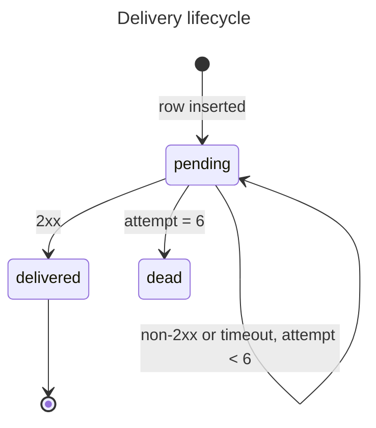

# 03 — Retry worker, backoff and dead state

Depends on: 01

## Context

- Pending delivery rows accumulate and nothing sends them.
- A merchant whose endpoint is down for an afternoon currently loses every event in that window, silently.

## Build

A worker that claims deliveries whose next attempt is due, POSTs the stored payload unchanged, and records the result as an attempt. Six failures end the delivery's life and raise one alert.

## Constraints

- **Backoff is 1m, 5m, 25m, 2h, 10h, 48h.** Fixed schedule, no jitter, no per-merchant configuration — queue depth is only predictable because the schedule is.
- **Two workers never send the same delivery twice.** Claiming locks the row; the merchant has no idempotency key to dedupe on.
- **The payload is sent exactly as stored.** Not re-serialized, not re-fetched from the record it came from.
- **A timeout is an attempt, not a crash.** It records the error with no status, and the worker moves to the next row.
- **A dead delivery is never claimed again.** Only an explicit replay brings it back.
- **One alert per endpoint per hour.** A merchant's outage produces hundreds of dead deliveries, and an alert each means nobody reads any.
- **The alert names the merchant and the endpoint,** enough to act on without opening the dashboard.
- **Background jobs claim work with a locking query and log one structured line per claim,** as the payout worker does.

## Done when

- A due pending delivery is POSTed and marked delivered on any 2xx.
- A non-2xx response records an attempt with its status and schedules the next one on the backoff schedule.
- A timeout records an attempt with the error and no status.
- A delivery that has failed six times is dead and stops being claimed.
- Going dead fires one alert naming the merchant and the endpoint.
- A second dead delivery for the same endpoint inside the hour fires nothing.
- Two workers running against the same queue never send one delivery twice.

## Tests

- **Integration** — a pending delivery due now, endpoint returns 200: marked delivered, one attempt recorded with its duration.
- **Integration** — endpoint returns 500: state stays pending, `attempt_count` is 1, `next_attempt_at` is one minute out.
- **Integration** — the sixth failure moves it to dead: start at `attempt_count` 5, endpoint returns 500.
- **Integration** — endpoint times out: attempt recorded with the error and a null status, no exception escapes the worker.
- **Integration** — a dead delivery due in the past is not claimed on the next pass.
- **Integration** — two dead deliveries for one endpoint, four minutes apart: one alert.
- **Integration** — a delivery not yet due is not claimed: `next_attempt_at` one minute in the future.
- **Unit** — the backoff schedule: attempt 0 gives 1m, attempt 4 gives 10h, attempt 5 gives 48h.

## Out of scope

- **Bringing a dead delivery back** — issue 05.
- **Showing any of this to a merchant** — issues 04 and 06.
