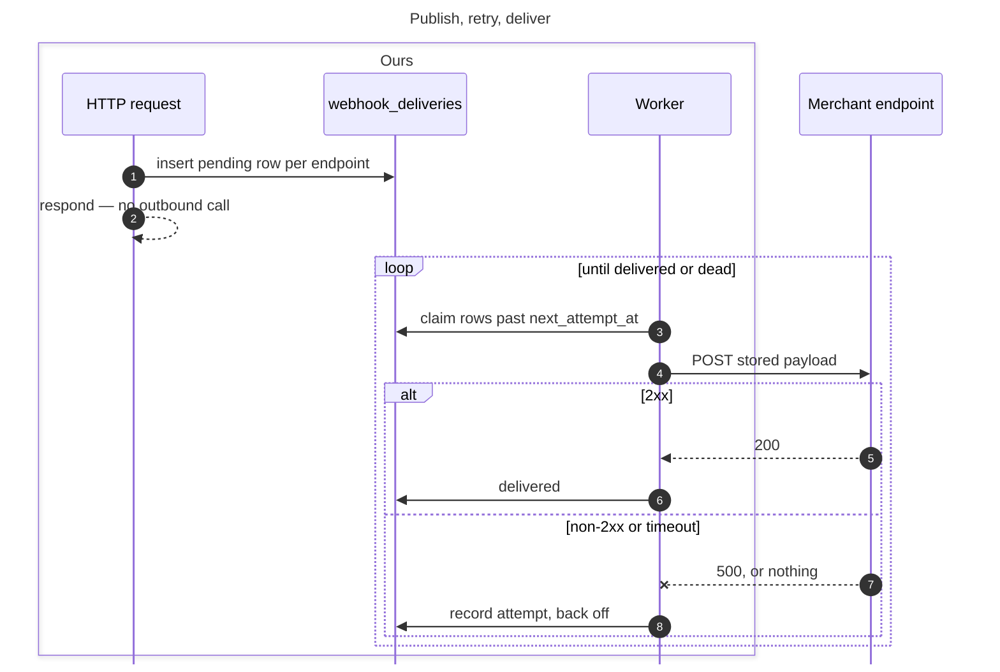
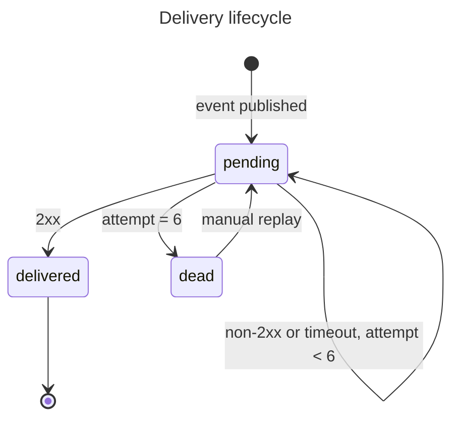

# Webhook delivery retries

## Context

- A webhook that fails delivery is dropped. The event is gone — no record it existed, no way to replay it.
- Merchants find out by reconciling payouts against their own ledger days later, and support has nothing to look at when they ask.
- 4.1% of deliveries failed last month. Every one was a silent data loss for the merchant.

## Out of scope

- **Webhook signing and secret rotation** — a separate ask, and it changes the request body. Doing both at once means no clean rollback.
- **Merchant-configurable retry schedules** — nobody has asked for it, and a fixed schedule is what lets us reason about queue depth.
- **Events other than payments** — payouts and disputes publish through a different path that doesn't share this dispatcher.

## Flow





## Plan

### 1 — Delivery and attempt tables

**Types**

```ruby
DeliveryState = "pending" | "delivered" | "dead"
```

**Schema**

```ruby
class CreateWebhookDeliveries < ActiveRecord::Migration[7.1]
  def change
    create_table :webhook_deliveries do |t|
      t.references :merchant, null: false, foreign_key: true
      t.string   :event_type, null: false
      t.string   :endpoint_url, null: false
      t.jsonb    :payload, null: false
      t.string   :state, null: false, default: "pending"  # DeliveryState
      t.integer  :attempt_count, null: false, default: 0
      t.datetime :next_attempt_at, null: false
      t.timestamps
    end
    add_index :webhook_deliveries, [:state, :next_attempt_at]

    create_table :webhook_delivery_attempts do |t|
      t.references :webhook_delivery, null: false, foreign_key: true
      t.integer  :number, null: false
      t.integer  :http_status
      t.string   :error
      t.integer  :duration_ms, null: false
      t.datetime :created_at, null: false
    end
  end
end
```

**Constraints**

- `DeliveryState` is enforced in the model, not the database. The set changes more often than a migration is worth.
- `payload` is written once at insert and never updated. A replay six hours later sends what the event said then, not what the record says now.
- `[state, next_attempt_at]` is the claim query's index. Changing the worker's claim predicate means changing this index.
- `webhook_delivery_attempts` is append-only. `number` is unique per delivery and never reused, including across replays.

### 2 — Publish writes a delivery row

**Types**

```ruby
# Byte-identical to what the old inline path POSTed. Stored in payload.
WebhookEnvelope = {
  id:         String,   # event id, not delivery id
  type:       String,   # event_type
  created_at: String,   # ISO8601, the event's time
  data:       Hash      # resource snapshot at publish
}
```

**Interfaces**

```ruby
Webhooks::Publish.call(merchant:, event_type:, data:)  # => Array<WebhookDelivery>
Webhooks::Endpoints.for(merchant:, event_type:)        # => Array<String>
Webhooks::Envelope.build(event_type:, data:)           # => WebhookEnvelope
```

**Callstack**

```
-> Webhooks::Publish.call
  -> Webhooks::Endpoints.for
  -> Webhooks::Envelope.build
  -> WebhookDelivery.insert_all
```

**Constraints**

- One `pending` row per endpoint returned by `Endpoints.for`. A merchant with three endpoints subscribed to `payment.succeeded` gets three rows.
- `next_attempt_at` is set to now, so the first attempt is the next worker pass.
- `Publish.call` makes no outbound HTTP call. The request path returns before anything leaves the process.
- A merchant with no endpoints subscribed produces no rows and no error.
- `Envelope.build` runs once per publish. Two endpoints for the same event receive identical bytes.

### 3 — Retry worker

**Types**

```ruby
DeliveryResult = Struct.new(:http_status, :error, :duration_ms, keyword_init: true) do
  def success? = http_status&.between?(200, 299)
end
```

**Interfaces**

```ruby
Webhooks::DispatchJob#perform                  # => void, enqueued every 30s
Webhooks::Dispatcher#process_due(limit: 100)   # => Integer, deliveries attempted
Webhooks::Dispatcher#claim_due(limit:)         # => Array<WebhookDelivery>
Webhooks::Dispatcher#deliver(delivery)         # => DeliveryResult
Webhooks::Backoff.next_at(attempt_count)       # => Time
```

**Callstack**

```
-> Webhooks::DispatchJob#perform
  -> Dispatcher#process_due
    -> Dispatcher#claim_due
    -> Dispatcher#deliver
      -> Net::HTTP.post
      -> WebhookDeliveryAttempt.create!
      -> Backoff.next_at
      -> delivery.update!
```

**Constraints**

- `claim_due` selects `state = "pending" AND next_attempt_at <= now()` with `FOR UPDATE SKIP LOCKED`. Two workers never send the same delivery twice — the merchant has no idempotency key to dedupe on.
- `Backoff.next_at` returns now + `[1m, 5m, 25m, 2h, 10h, 48h][attempt_count]`. Two and a half days total, enough to cover a weekend outage on the merchant's side.
- The POST sends `payload` unchanged. The worker never re-serializes it.
- The request times out at 10s. A timeout returns a `DeliveryResult` with `error` set and `http_status` nil — it never raises out of `deliver`.
- An attempt row is written on every outcome, success or failure. `attempt_count` increments in the same transaction.
- A 2xx sets `state` to `"delivered"` and stops further claims. Anything else leaves it `"pending"` with a new `next_attempt_at`.

### 4 — Dead state and alerting

**Interfaces**

```ruby
Webhooks::Dispatcher#mark_dead(delivery)       # => void
Webhooks::DeadAlert.fire(delivery)             # => Boolean, false when suppressed
Webhooks::DeadAlert.suppressed?(endpoint_url)  # => Boolean
```

**Callstack**

```
-> Dispatcher#deliver
  -> Dispatcher#mark_dead
    -> delivery.update!(state: "dead")
    -> Webhooks::DeadAlert.fire
      -> DeadAlert.suppressed?
      -> Notifier.page
```

**Constraints**

- A non-2xx on attempt 6 sets `state` to `"dead"`. `claim_due` never returns it again.
- `MAX_ATTEMPTS = 6` is the same constant that bounds `Backoff.next_at`'s schedule. The two can't drift.
- The alert names the merchant id and the endpoint URL. Nothing else is enough to act on it.
- Suppression keys on `endpoint_url` alone, for one hour. One merchant's outage produces hundreds of dead deliveries, and an alert each means nobody reads any.
- A suppressed alert still marks the delivery dead. Suppression silences the page, never the state change.

### 5 — Deliveries API

**Inputs & outputs**

```
GET /v1/webhook_deliveries
Headers:
  - Authorization: Bearer <merchant api key>   // scopes every result
Query:
  - state: DeliveryState                       // optional
  - event_type: String                         // optional, exact match
  - limit: Integer, 1..100, default 25
Returns:
  - 200: { data: Array<WebhookDeliveryResource> }
  - 401: unauthenticated
  - 422: state or event_type outside the known set
```

**Types**

```ruby
WebhookDeliveryResource = {
  id:              String,
  event_type:      String,
  endpoint_url:    String,
  state:           DeliveryState,
  attempt_count:   Integer,
  next_attempt_at: String,                 # ISO8601, null once delivered or dead
  created_at:      String,
  payload:         WebhookEnvelope,
  attempts:        Array<AttemptResource>  # ascending by number
}

AttemptResource = {
  number:      Integer,
  http_status: Integer,  # null on timeout
  error:       String,   # null on a response
  duration_ms: Integer,
  created_at:  String
}
```

**Interfaces**

```ruby
Api::V1::WebhookDeliveriesController#index
Webhooks::DeliveryQuery.call(merchant:, state: nil, event_type: nil, limit: 25)
```

**Callstack**

```
-> GET /v1/webhook_deliveries
  -> Api::V1::WebhookDeliveriesController#index
    -> authenticate_merchant!
    -> Webhooks::DeliveryQuery.call
    -> WebhookDeliverySerializer.render
```

**Constraints**

- Every query is scoped to the authenticated merchant. There is no parameter that widens it.
- Ordered `created_at DESC, id DESC`. The tiebreak matters — a publish writes several rows in one statement with identical timestamps.
- Attempts come back inline, never as a second call. Every consumer of this endpoint needs them, and a second round trip per delivery is what makes a list of fifty unusable.
- An unknown `state` or `event_type` returns 422, not an empty list. An empty list reads as "no deliveries" and hides the typo.

### 6 — Replay endpoint

**Inputs & outputs**

```
POST /v1/webhook_deliveries/:id/replay
Headers:
  - Authorization: Bearer <merchant api key>
Body: none
Returns:
  - 200: WebhookDeliveryResource        // state is "pending" again
  - 401: unauthenticated
  - 404: no such delivery for this merchant
  - 409: state is not "dead"
```

**Interfaces**

```ruby
Api::V1::WebhookDeliveryReplaysController#create
Webhooks::Replay.call(delivery)  # => WebhookDelivery
```

**Callstack**

```
-> POST /v1/webhook_deliveries/:id/replay
  -> Api::V1::WebhookDeliveryReplaysController#create
    -> authenticate_merchant!
    -> Webhooks::Replay.call
      -> delivery.update!(state:, attempt_count:, next_attempt_at:)
    -> WebhookDeliverySerializer.render
```

**Constraints**

- Only a `"dead"` delivery can be replayed. `"pending"` and `"delivered"` both return 409 — one would double-send, the other resends what the merchant already has.
- A delivery belonging to another merchant returns 404, not 403. A 403 confirms the id exists.
- `Replay.call` sets `attempt_count` to 0 and `next_attempt_at` to now. The full backoff schedule starts over.
- The attempts from the failed run are not deleted. `number` continues from the highest already recorded, so after a replay `attempt_count` is lower than `attempts.count` — the first is the backoff position, the second is the history.
- The response returns before anything is sent. The worker delivers on its next pass, and the replayed send is recorded as an ordinary attempt.

### 7 — Dashboard delivery view

**Prototype**

[spec.prototype.html](spec.prototype.html) — the list at three states, the filter, and the replay button appearing only on a dead row. Static fixtures, no network.
**Types**

```ts
type DeliveryRow = {
  id: string
  eventType: string
  endpointUrl: string
  state: DeliveryState
  lastAttempt: AttemptResource | null   // null before the first attempt
}

type DeliveryFilter = {
  state?: DeliveryState
  eventType?: string
}
```

**Interfaces**

```ts
fetchDeliveries(filter: DeliveryFilter): Promise<DeliveryRow[]>
replayDelivery(id: string): Promise<DeliveryRow>

<DeliveryList />
<DeliveryListRow delivery={DeliveryRow} />
<ReplayButton deliveryId={string} />
```

**Callstack**

```
-> <DeliveryList />
  -> fetchDeliveries
    -> GET /v1/webhook_deliveries
  -> <DeliveryListRow /> per delivery
    -> <ReplayButton />            // rendered only when state is "dead"
      -> replayDelivery
        -> POST /v1/webhook_deliveries/:id/replay
```

**Constraints**

- The row shows state, event type, endpoint and the last attempt's result. Nothing else fits at list width.
- Changing the filter issues a new request with the `state` query param. There is no client-side filtering — the list is capped at `limit`, so filtering what arrived would hide matching rows.
- `<ReplayButton />` renders only when `state` is `"dead"`. The other states are 409s, and a button that always errors is worse than no button.
- A successful replay swaps the row from the 200 body. No refetch, no reload.
- A 409 on replay means another tab already replayed it. The row refetches instead of showing an error.

## Assumptions

- **Merchant endpoints are idempotent on repeat delivery of the same event.** If wrong, a retry after a timeout that actually succeeded double-charges their ledger, and we have no key for them to dedupe on.
- **Two and a half days of retries covers real outages.** If wrong, deliveries die while the merchant is still fixing their side and every recovery becomes a manual replay.
- **Queue depth stays inside one worker's capacity at current volume.** If wrong, deliveries drift past their scheduled attempt time and `Backoff.next_at` stops meaning anything.
- **`payload` is safe to return to the merchant.** If wrong, the deliveries API leaks a resource snapshot that the merchant's own API scopes more tightly than the webhook did.

## Open questions

- Does `Publish.call` run inside the caller's transaction? Rows inserted and then rolled back would leave the worker delivering events that never happened.
- Is `limit` enough, or does the deliveries list need cursor pagination? A merchant with a long outage has thousands of dead deliveries and no way past the first 100.
- Does a dead delivery ever expire, or does it sit in the dashboard forever?
- Who receives the dead-delivery alert — the merchant, or our on-call?

## QA Plan

- Publish an event to an endpoint that returns 200. It shows as delivered with one attempt.
- Point an endpoint at a server returning 500. Watch the attempts accumulate on the backoff schedule.
- Kill the endpoint mid-request so it times out. Confirm the attempt records the error with no status, and the worker keeps running.
- Let one delivery reach its sixth failure. Confirm it goes dead and one alert fires naming the merchant and endpoint.
- Take a second delivery for the same endpoint to dead within the hour. Confirm no second alert, and that it still shows as dead.
- Replay the dead delivery against a now-healthy endpoint. Confirm it delivers, the attempt numbers continue rather than restart, and `attempt_count` shows 1.
- Replay the same delivery again. Confirm 409.
- Filter the list by state from the UI. Confirm a new request goes out rather than the rows filtering in place.
- Log in as a different merchant. Confirm none of the above deliveries are visible, and that fetching one by id returns 404.
