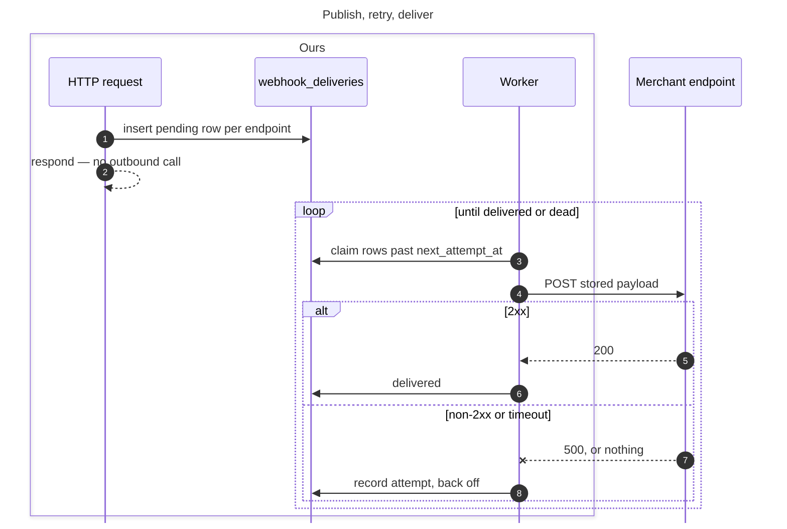
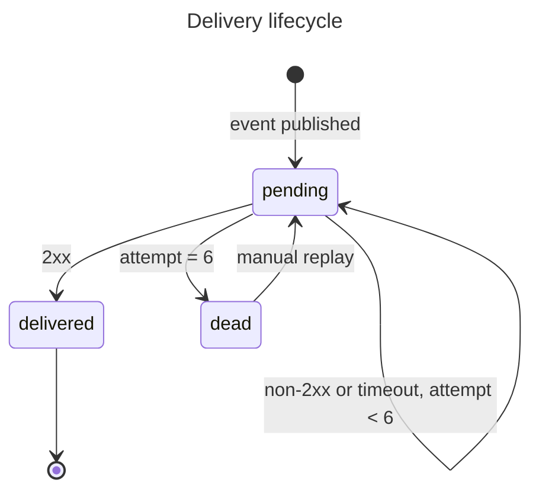

# Webhook delivery retries

## Context

- A webhook that fails delivery is dropped. The event is gone — no record it existed, no way to replay it.
- Merchants find out by reconciling payouts against their own ledger days later, and support has nothing to look at when they ask.
- 4.1% of deliveries failed last month. Every one was a silent data loss for the merchant.

## Out of scope

- **Webhook signing and secret rotation** — a separate ask, and it changes the request body. Doing both at once means no clean rollback.
- **Merchant-configurable retry schedules** — nobody has asked for it, and a fixed schedule is what lets us reason about queue depth.
- **Events other than payments** — payouts and disputes publish through a different path that doesn't share this dispatcher.

## Plan

### Flow





### 1 — Delivery and attempt tables

```ruby
class CreateWebhookDeliveries < ActiveRecord::Migration[7.1]
  def change
    create_table :webhook_deliveries do |t|
      t.references :merchant, null: false, foreign_key: true
      t.string   :event_type, null: false
      t.string   :endpoint_url, null: false
      t.jsonb    :payload, null: false
      t.string   :state, null: false, default: "pending"
      t.integer  :attempt_count, null: false, default: 0
      t.datetime :next_attempt_at, null: false
      t.timestamps
    end
    add_index :webhook_deliveries, [:state, :next_attempt_at]

    create_table :webhook_delivery_attempts do |t|
      t.references :webhook_delivery, null: false, foreign_key: true
      t.integer  :number, null: false
      t.integer  :http_status
      t.string   :error
      t.integer  :duration_ms, null: false
      t.datetime :created_at, null: false
    end
  end
end
```

### 2 — Publish writes a delivery row

- Publishing an event inserts a pending delivery row per configured endpoint.
- The request path makes no outbound HTTP call.
- The payload stored matches what the old inline path sent, byte for byte.
- The payload is frozen at insert. A replay six hours later sends what the event said then, not what the record says now.

### 3 — Retry worker

- A worker claims pending deliveries whose `next_attempt_at` has passed, POSTs the stored payload unchanged, and records an attempt.
- Attempts back off 1m, 5m, 25m, 2h, 10h, 48h — two and a half days, enough to cover a weekend outage on the merchant's side.
- Two workers against the same queue never send the same delivery twice. The merchant has no idempotency key to dedupe on.
- A timeout is recorded as an attempt with the error, not a crash.

### 4 — Dead state and alerting

- A delivery that fails its sixth attempt moves to dead and stops being claimed.
- Going dead fires one alert naming the merchant and the endpoint.
- A second dead delivery for the same endpoint inside the hour fires nothing. One merchant's outage produces hundreds, and an alert each means nobody reads any.

### 5 — Deliveries API

- A merchant's deliveries come back newest first, filterable by state and event type.
- Each delivery carries its attempts inline, with status, error and duration. The dashboard shows them expanded by default, so a second call is never skipped.
- A merchant cannot read another merchant's deliveries.

### 6 — Replay endpoint

- Replaying a dead delivery makes it pending with its attempt count reset, and the worker picks it up on the next pass.
- Replaying a pending or delivered delivery is rejected. One double-sends, the other resends what the merchant already has.
- The replayed send is recorded as an attempt like any other.

### 7 — Dashboard delivery view

- The list shows state, event type, endpoint and last attempt result.
- The state filter works from the UI.
- Replay appears only on dead deliveries, and the new state shows without a reload.

## Assumptions

- **Merchant endpoints are idempotent on repeat delivery of the same event.** If wrong, a retry after a timeout that actually succeeded double-charges their ledger, and we have no key for them to dedupe on.
- **Two and a half days of retries covers real outages.** If wrong, deliveries die while the merchant is still fixing their side and every recovery becomes a manual replay.
- **Queue depth stays inside one worker's capacity at current volume.** If wrong, deliveries drift past their scheduled attempt time and the backoff schedule stops meaning anything.

## Open questions

- Should a merchant be able to replay a delivery themselves, or only support?
- Does a dead delivery ever expire, or does it sit in the dashboard forever?
- Who receives the alert — the merchant, or our on-call?

## QA Plan

- Publish an event to an endpoint that returns 200. It shows as delivered with one attempt.
- Point an endpoint at a server returning 500. Watch the attempts accumulate on the backoff schedule.
- Let one delivery reach its sixth failure. Confirm it goes dead and one alert fires.
- Take a second endpoint for the same merchant to dead within the hour. Confirm no second alert.
- Replay the dead delivery against a now-healthy endpoint. Confirm it delivers and the attempt is recorded.
- Try the replay button on a delivered delivery. Confirm it isn't there.
- Log in as a different merchant. Confirm none of the above deliveries are visible.
